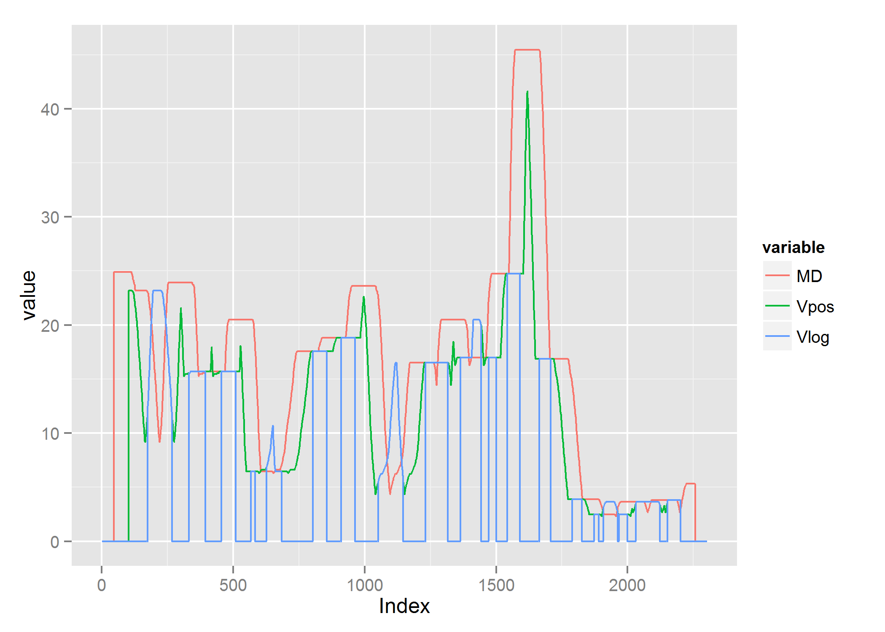

#Introduction


The following implementation is an open source reconstruction of the published algorithm by Stephen A. Ramsey, Bioinformatics Vol. 26, 2010 <http://bioinformatics.oxfordjournals.org/>.

The following code is open source, **built under R and C++ using the standard RStudio toolset including Rtools** in a Windows 7 64 bit mainframe.
The used pacakges were:

- ggplot2
- Rcpp
- dplyr
- reshape2

Additional functions are provided via gitHub distribution, and should be runned "as is". <https://github.com/GbalsaC/TFBSValley>

## Purpose & Aims
Development of a new prediction method of potential **transcriptional factors binding sites (TFBS)** combining ChIP-Seq  data obtained from mammal cell regulatory regions. 
This method's prediction rate should outperform the actual ChIP-Seq based techniques. 


### Initial Configurations and Setup
The test case includes **aa.csv** which is data obtained from the original algorithm simulating signal.

> When used on other local machines, **setwd()** should be changed to the cloned or forked repository accordingly.
**signal** is imported (or should be) as a numeric vector, as follows:


```r
setwd("B:/Documents/R/TFBSValley")
signal<-as.numeric(read.csv("aa.csv", header=F)[1,])
### Requires multiplot.R, Rcpp, ggplot
head(signal);
```

```
## [1] 11 11 12 12 10 10
```

# Code Body
### Definition and Parameters

The first process is defining the function, which requires two inputs:

1. **signal**: A numeric vector, on the first commits of this code it's ideally a csv row vector. On the following commits, the ideal file should be a BamFile, commonly used in Bioinformatics.
2. **index**: The number of the first element within a genomic sequence or a chromosome range sequence. It's purpose is simply identifying the sequence's domain, therefore it's an optional input.

Additionally, the function requires loading the necessary libraries.


```r
RamseyR <- function(signal, index=1){
        ##Packages, sourceCpp has rebuild False
        library(ggplot2);
        library("dplyr");
        library(Rcpp);
        library("reshape2");
        sourceCpp("LemireR.cpp");
        source('multiplot.R');
```


```cpp
#include <Rcpp.h>
#include <iostream>
#include <vector>
#include <deque>
#include <fstream>      // fstream
#include <string>
#include <sstream>
#include <algorithm>    // copy
#include <math.h>
#include <iterator>     // ostream_operator
using namespace Rcpp;
using namespace std;
typedef unsigned int uint;

//Allocate memory for size, window and pointer for dynamic memory allocation
double *maxval;
double *minval;

long sizeArray;
long index, index2;
//std::vector<double> a;
std::deque<int> U, L;
int n;


// [[Rcpp::export]]
NumericMatrix lemireR(NumericVector a, int w, int offset, double Depth){
        index = 0; index2 = 0;
        sizeArray = a.size() + 1;
        //A = new double[sizeArray];
        NumericVector A1(sizeArray);
        NumericVector A2(sizeArray);        
	NumericMatrix A(a.size(), 5);
	minval = new double[sizeArray];
	maxval = new double[sizeArray];


	for (long i = 1; i < a.size(); ++i)
	{
		if (i >= w)
		{
			maxval[i - w] = a[U.size()>0 ? U.front() : i - 1];
			minval[i - w] = a[L.size()>0 ? L.front() : i - 1];
		}
		if (a[i]>a[i - 1])
		{
			L.push_back(i - 1);
			if (i == w + L.front())
			{
				L.pop_front();
			}
			while (U.size()>0)
			{
				if (a[i] <= a[U.back()])
				{
					if (i == w + U.front())
					{
						U.pop_front();
					}
					break;
				}
				U.pop_back();
			}
			//End While
		}
		else
		{
			U.push_back(i - 1);
			if (i == w + U.front())
			{
				U.pop_front();
			}
			while (L.size()>0)
			{
				if (a[i] >= a[L.back()])
				{
					if (i == w + L.front())
					{
						L.pop_front();
					}
					break;
				}//END IF
				L.pop_back();
			}//END While
		}//End If-Else
	}//END FOR
	maxval[a.size() - w] = a[U.size()>0 ? U.front() : a.size() - 1];
	minval[a.size() - w] = a[L.size()>0 ? L.front() : a.size() - 1];

	//myfile is optionally only usable as csv output
	for (long l = 1; l < sizeArray; l++){
		if (l < sizeArray - (w))
		{
        		A(l-1+(w/2), 0) = maxval[l];
                        //A(0, l-1) = maxval[l];
        		//myfile << maxval[l] << ",";
		}
                else if(l < sizeArray - (w/2))
		{
			A(l-1+(w/2), 0) = 0;
			//myfile << 0 << ",";
		}
                /* 
                */
	}
	//myfile << "\n";
        /*
        // Minval filter is muted as output since a "custom" implementation is in order
	for (long k = 1; k < sizeArray; k++){
				//if (k < sizeArray - w)
                if (k < sizeArray - (w))
		{
			A(2, k-1+(w/2)) = minval[k];
            //A(1, k-1) = minval[k];
			//myfile << minval[k] << ",";
		}
                
		else if (k < sizeArray - (w/2))
		{
			A(2, k-1+(w/2)) = 0;
			//myfile << 0 << ",";
		}
                
                 
	}
        */
        n = w + offset;
        // C++ code for V(pos) in Ramsey's Matlab 
	for (long pos = 1; pos < sizeArray-1; pos++){
                if ((pos >= n) && (pos < (sizeArray - w))){
			A(pos, 1) = min(A(lrint(pos + offset + w / 2), 0), A(lrint(pos - offset - w / 2),0));
                        
		}
		else {
			A(pos, 1) = 0;
		}
                //Create logical comparison of A(pos,1) with a[]
                //Consider previous pos if, if 0 then it's false for all comparisons
                // Of the type A(pos,1)*Depth > a[pos]
                if((A(pos, 1)*Depth)>a[pos]){
                        A(pos, 2)=A(pos, 1);
                }
                
                
	}
        

	//myfile.close();
	delete[] maxval;
	delete[] minval;
	return A;
}
	

```


Similarly to the original algorithm, default parameters are defined as follows:


### Reducing noise
The next step involves noise reduction by:

1. Using a normal distribution to get the range for a convolution function
2. Using convolution to smooth signal according to a predefined normal distribution


### Calling C++ function.
The function lemireR is built with Rcpp package and RStudio as mentioned in the introduction, the code can [be accessed here](/blob/master/LemireR.cpp). 
The code returns a five column matrix to which the index numeration is binded as reference.

The columns are ordered as:
1. **Index**: a localization numeral indicating the specified region on a genetic element.
2. **MD**: The Max filter signal, adjusted for domain +/- newWin, in order to obtain half a window after and before the original signal.
3. **Vpos**: The minimum value between two elements, the comparison of minimum elements is made by **+/- offset + (newWin/2)**, this is the valley's minimum value, used to determine valley regions by comparison.
4. **Vlog**: Using Vpos x Depth, using a boolean comparison, set to true wherever (Vpos x Depth) > signal.


```r
        M = lemireR(a=M, w=newWin+1, offset=10, Depth=0.8); 
        
        length <- dim(M)[1];
        M<-cbind(c(index:(index-1+length)),M);
        colnames(M)<-c('Index','MD', 'Vpos', 'Vlog', 'Begin', 'End');
        head(M[300:500,]);
```

```
##      Index       MD     Vpos Vlog Begin End
## [1,]   300 23.91429 21.11429    0     0   0
## [2,]   301 23.91429 21.57143    0     0   0
## [3,]   302 23.91429 21.17143    0     0   0
## [4,]   303 23.91429 20.68571    0     0   0
## [5,]   304 23.91429 20.14286    0     0   0
## [6,]   305 23.91429 19.62857    0     0   0
```

In retrospect, the valley regions are actually comparison between the signal and the smallest value of max filter's +/- newWindow region.

 

```
## Saving 7 x 7 in image
```


 


Note that the `echo = FALSE` parameter was added to the code chunk to prevent printing of the R code that generated the plot.


